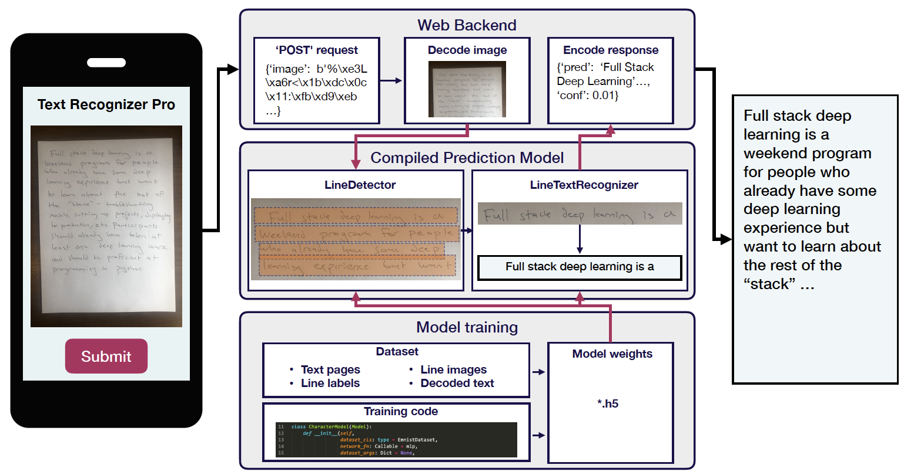

### Full Stack DL System (PyTorch)  
----------------------------------
[`text recognizer`](https://github.com/full-stack-deep-learning/fsdl-text-recognizer-project) implementation with PyTorch

1. Application structure (adapted from [this](https://fullstackdeeplearning.com/march2019)) 

2. Line detection

3. Line prediction


4. Accuracy

Line detection:
| network | Pixel Acc |
| ------------- | ------------- |
| FCN | 0.928 |

Line Prediction:
| network | Character Acc |
| ------------- | ------------- |
| Sliding+CNN+RNN+CTC | 0.765 |
| CRNN + CTC| 0.808 |


### Usage
-------------
After clone the repo, make a directory `data` at the same level with `core` to store data
```bash
# setup and activate environment
conda env create -f env_pytorch.yml
source activate $(head -1 env_pytorch.yml | cut -d' ' -f2)

# make sure all tests/evaluation passed
cd core
pytest -s text_recognizer/tests/*
pytest -s text_recognizer/evaluation/*

# have fun

# training
sh tasks/train_character_predictor.sh

# loacl prediction
python3 api/app.py

# build, run, and access docker
sh tasks/build_api_docker.sh # build
docker run -p 8000:8000 --name api -it --rm text_recognizer_api # run 
curl "http://0.0.0.0:8000/v1/predict?image_url=http://s3-us-west-2.amazonaws.com/fsdl-public-assets/emnist_lines/or%2Bif%2Bused%2Bthe%2Bresults.png" # access the dockerized API


```


### Dependencies
* conda
* docker
* ubuntu 18.04LTS

### Changes to the original repo
-------------
1. Single-character prediction
2. LineTextRecognizer
3. Tools for exprimentation
4. Experimentation
5. LineDetection
6. Data versioning
7. Continuous integration
8. Deployment

### Future
-------------